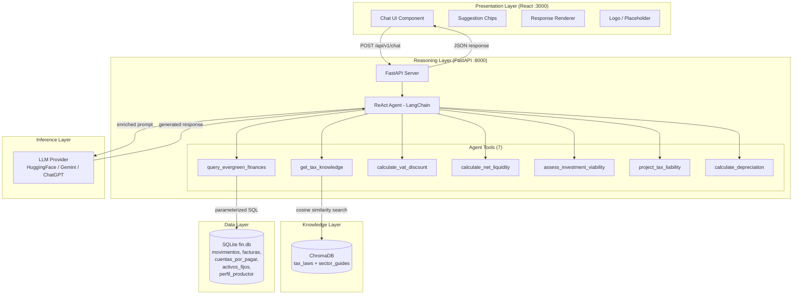
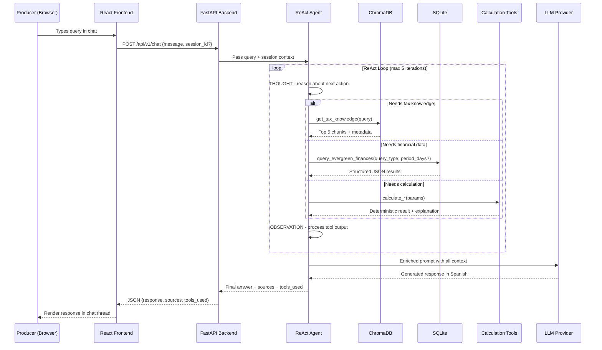
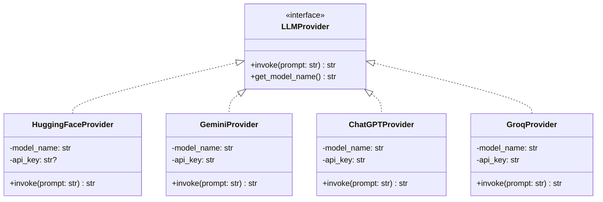

# Design Document: FIN-Advisor RAG

## Overview

FIN-Advisor is a RAG-based AI financial assistant for Colombian agricultural producers, embedded in the EverGreen Finance (FIN) module. The system combines three data sources — a vectorized knowledge base of Colombian tax law (ChromaDB), the producer's real-time financial data (SQLite), and deterministic calculation tools — orchestrated by a LangChain ReAct agent backed by a configurable LLM (HuggingFace default, Gemini API, or ChatGPT API).

The MVP delivers a React chat frontend, a FastAPI backend with standard HTTP request/response (SSE streaming deferred to Phase 2), a full ETL pipeline for knowledge base ingestion, synthetic mock data generation, and optional Docker Compose orchestration. All responses are in Spanish, grounded in retrieved documents, and include disclaimers for financial advice.

### Key Design Decisions

| Decision | Choice | Rationale |
|---|---|---|
| LLM Providers | HuggingFace (default), Gemini API, ChatGPT API, Groq API | User has free HuggingFace access and paid Gemini; Strategy pattern enables switching via env vars. Groq offers extremely fast inference (≤400ms) |
| Embedding Model | `intfloat/multilingual-e5-small` (384-dim) | Optimized for Spanish/legal text, ~134MB, runs on CPU, standardized across ETL and retrieval |
| Vector Store | ChromaDB (persistent local) | Free, Python-native, metadata filtering, LangChain integration |
| Relational DB | SQLite | Zero-config, built-in Python, single-file, perfect for mock data |
| Agent Framework | LangChain `create_react_agent` | Mature ReAct support, native tool calling, integrates with all chosen components |
| Streaming | Deferred to Phase 2 | MVP uses standard POST → JSON response; SSE adds complexity without core value for demo |
| Docker | Optional convenience | System runs without Docker via `npm start` + `uvicorn`; Docker Compose provided for reproducibility |
| Calculation Tools | 5 single-purpose tools (not monolithic) | Clearer agent reasoning, simpler input schemas, better error isolation, easier testing |
| Documentation Language | Spanish (all READMEs, docstrings, comments) | Consistent with target audience (Colombian agricultural producers) and university project context |

## Architecture

The system follows a layered architecture with four distinct layers, all running locally.



### Request Flow



### Folder Structure

All implementation lives inside `RAG-FIN-Topicos-Avanzados/` (Git repository root).

**Documentation language:** All README.md files, project documentation, code comments, and docstrings are written in Spanish.

```
RAG-FIN-Topicos-Avanzados/
├── agent/                    # LangChain ReAct agent
│   ├── __init__.py
│   ├── prompt.md              # System prompt definition (Markdown)
│   ├── agent_config.py       # Agent creation and LLM provider setup
│   ├── llm_providers.py      # Strategy pattern: HuggingFace, Gemini, ChatGPT
│   └── tools/
│       ├── __init__.py
│       ├── get_tax_knowledge.py
│       ├── query_evergreen_finances.py
│       ├── calculate_vat_discount.py
│       ├── calculate_net_liquidity.py
│       ├── assess_investment_viability.py
│       ├── project_tax_liability.py
│       └── calculate_depreciation.py
├── backend/                  # FastAPI server
│   ├── __init__.py
│   ├── app.py                # FastAPI application factory
│   ├── routes.py             # /api/v1/chat, /api/v1/health
│   ├── models.py             # Pydantic request/response models
│   └── middleware.py         # CORS configuration
├── frontend/                 # React chat interface
│   ├── public/
│   ├── src/
│   │   ├── components/
│   │   │   ├── ChatUI.jsx
│   │   │   ├── SuggestionChips.jsx
│   │   │   ├── ResponseRenderer.jsx
│   │   │   └── Logo.jsx
│   │   ├── App.jsx
│   │   └── index.jsx
│   └── package.json
├── scripts/                  # Standalone utilities
│   ├── etl_ingest.py         # ETL pipeline: MD → chunks → embeddings → ChromaDB
│   ├── generate_mock_data.py # Synthetic SQLite data generation
│   ├── init_chromadb.py      # ChromaDB collection initialization
│   ├── embedding_reference.py # Embedding model reference code
│   ├── llm_provider_reference.py  # LLM provider factory + cost analysis
│   └── react_agent_reference.py   # ReAct agent setup reference
├── knowledge_base/           # Markdown source documents for RAG
│   ├── estatuto_tributario_libro1.md
│   ├── estatuto_tributario_libro3.md
│   ├── beneficios_compra_maquinaria.md
│   ├── exenciones_pequeno_productor.md
│   ├── programas_gobierno_agro.md
│   └── calendario_tributario_2024.md
├── tests/                    # pytest + hypothesis tests
│   ├── test_calculation_tools.py
│   ├── test_query_finances.py
│   ├── test_etl_pipeline.py
│   ├── test_get_tax_knowledge.py
│   ├── test_api_validation.py
│   ├── test_mock_data_generation.py
│   ├── test_session_management.py
│   └── conftest.py
├── .env.example              # Environment variable template
├── requirements.txt          # Python dependencies
├── docker-compose.yml        # Optional Docker orchestration
├── Dockerfile.backend
├── Dockerfile.frontend
└── README.md
```

## Components and Interfaces

### 1. Chat Interface (React Frontend)

Renders the conversational UI at `http://localhost:3000`.

**Components:**
- `ChatUI` — Main chat container with message thread, text input (500-char soft limit), character counter, and submit button (disabled when input is empty/whitespace)
- `SuggestionChips` — Displays 3+ clickable example queries on load; clicking populates and auto-submits
- `ResponseRenderer` — Renders markdown-formatted responses from the agent using `react-markdown`
- `Logo` — FIN-Advisor logo in top-right; renders placeholder SVG/text if no logo file exists

**API Contract:**
```typescript
// Request
POST /api/v1/chat
{
  "message": string,       // required, user query in Spanish
  "session_id": string     // optional, for multi-turn context
}

// Response (200 OK)
{
  "response": string,      // agent's full response in Spanish
  "sources": [             // documents referenced
    { "article_number": string, "source_document": string, "topic_tags": string[] }
  ],
  "tools_used": string[]   // tool names invoked during reasoning
}

// Error (422)
{
  "detail": [{ "loc": [...], "msg": string, "type": string }]
}
```

**Error Handling:**
- Network errors or HTTP errors → display error message in Spanish + retry button
- Loading state → spinner/indicator while awaiting response

### 2. FastAPI Backend

Serves the API at `http://localhost:8000`.

**Endpoints:**

| Method | Path | Purpose |
|---|---|---|
| POST | `/api/v1/chat` | Accept user query, invoke ReAct agent, return response |
| GET | `/api/v1/health` | Return status of backend, vector_store, financial_database, llm_connection |

**Startup Behavior:**
1. Initialize ChromaDB connection (persistent local)
2. Initialize SQLite connection to `fin.db`
3. Initialize configured LLM provider (read `LLM_PROVIDER`, `LLM_API_KEY`, `LLM_MODEL_NAME` from env)
4. If LLM unreachable → log warning, start in degraded mode
5. If API key required but missing → fail to start with clear error

**Session Management:**
- `session_id` provided → maintain in-memory conversation history for multi-turn
- No `session_id` → single-turn interaction
- No cross-restart persistence required for MVP

**Middleware:**
- CORS configured to allow requests from frontend origin (`http://localhost:3000`)

### 3. ReAct Agent (LangChain)

Implemented via `create_react_agent` with max 5 reasoning iterations.

**7 Tools:**

| Tool | Category | Input | Output |
|---|---|---|---|
| `get_tax_knowledge` | Retrieval | search query (string) | Top 5 chunks + metadata |
| `query_evergreen_finances` | Retrieval | query_type (enum) + period_days? | Structured JSON |
| `calculate_vat_discount` | Calculation | purchase_price, vat_rate? | discount_amount, effective_cost, explanation |
| `calculate_net_liquidity` | Calculation | balance, receivables, payables | net_liquidity_now, net_liquidity_projected, explanation |
| `assess_investment_viability` | Calculation | balance, receivables, payables, purchase_cost, tax_benefit? | effective_cost, available_funds_*, viable_now, viable_in_days, explanation |
| `project_tax_liability` | Calculation | gross_income, deductions, tax_rate | taxable_income, estimated_tax, explanation |
| `calculate_depreciation` | Calculation | purchase_value, useful_life_years, years_elapsed | annual_depreciation, accumulated_depreciation, current_value, explanation |

**System Prompt:** Stored as `agent/prompt.md` (Markdown file, loaded at runtime). Instructs the agent to respond in Spanish, cite article numbers, format COP with thousand separators, include disclaimers, and decline out-of-scope topics (stocks, health, politics, hardware support, legal advice beyond tax). Using Markdown makes the prompt easy to edit and version independently from code.

### 4. LLM Provider Abstraction (Strategy Pattern)



#### Provider Comparison & Cost Analysis

| Provider | Model | Free Tier | Paid Cost | Spanish | Context Window | ReAct Support | Recommendation |
|---|---|---|---|---|---|---|---|
| **Gemini (Google)** | `gemini-1.5-flash` | 1,500 req/day | $0.35/1M input, $1.05/1M output | Excellent (LATAM-trained) | 1M tokens | Native function calling | **TOP PICK** for university |
| **Gemini Pro** | `gemini-1.5-pro` | 50 req/day | $3.50/1M input, $10.50/1M output | Excellent | 1M tokens | Native function calling | For complex reasoning |
| **HuggingFace** | `meta-llama/Llama-3.1-70B-Instruct` | Rate-limited | Pay-as-you-go | Good | 8K tokens | Via LangChain | Free default option |
| **OpenAI** | `gpt-4o-mini` | $5-18 student credit | $0.15/1M input, $0.60/1M output | Best-in-class | 128K tokens | Industry standard | If budget allows |
| **Groq** | `llama-3.3-70b-versatile` | ~14,000 req/day | Very affordable | Good (Llama 3.3) | 128K tokens | Via LangChain | Bonus: extremely fast (≤400ms) |

#### LangChain Integration (per provider)

**Gemini (recommended):**
```python
# pip install langchain-google-genai
from langchain_google_genai import ChatGoogleGenerativeAI

llm = ChatGoogleGenerativeAI(
    model="gemini-1.5-flash",
    temperature=0.3,  # Lower = more deterministic for financial advice
    google_api_key="YOUR_GEMINI_API_KEY"  # Free at makersuite.google.com
)
```

**HuggingFace Inference API:**
```python
# pip install langchain-huggingface
from langchain_huggingface import HuggingFaceEndpoint

llm = HuggingFaceEndpoint(
    repo_id="meta-llama/Llama-3.1-70B-Instruct",
    huggingfacehub_api_token="YOUR_HF_TOKEN",
    temperature=0.3,
    max_new_tokens=1024,
)
```

**OpenAI (ChatGPT):**
```python
# pip install langchain-openai
from langchain_openai import ChatOpenAI

llm = ChatOpenAI(
    model="gpt-4o-mini",
    temperature=0.3,
    openai_api_key="YOUR_OPENAI_API_KEY",
)
```

**Groq (bonus — fast):**
```python
# pip install langchain-groq
from langchain_groq import ChatGroq

llm = ChatGroq(
    model="llama-3.3-70b-versatile",
    temperature=0.3,
    groq_api_key="YOUR_GROQ_API_KEY",  # Free at groq.com
)
```

#### ReAct Agent Setup (LangChain)

```python
from langchain.agents import create_react_agent, AgentExecutor

agent = create_react_agent(llm=llm, tools=tools, prompt=prompt)
agent_executor = AgentExecutor(
    agent=agent,
    tools=tools,
    verbose=True,
    max_iterations=5,
    handle_parsing_errors=True,  # Important for robust error handling
)
```

Full reference code with all providers and agent setup is saved in:
- `scripts/llm_provider_reference.py` — Provider factory functions with cost notes
- `scripts/react_agent_reference.py` — ReAct agent creation with tool registration

#### Configuration via environment variables

- `LLM_PROVIDER`: `gemini` (recommended) | `huggingface` (default) | `chatgpt` | `groq`
- `LLM_API_KEY`: Required for all providers (Gemini free at makersuite.google.com, HuggingFace at huggingface.co/settings/tokens, Groq at groq.com)
- `LLM_MODEL_NAME`: Model identifier (provider-specific, see table above for defaults)

### 5. ETL Pipeline

Standalone script (`scripts/etl_ingest.py`) that processes knowledge base documents into ChromaDB.

**Pipeline Steps:**
1. Read Markdown files from `knowledge_base/` directory
2. Split using `RecursiveCharacterTextSplitter` (chunk size: 800 characters default, range 500-1000, 10% overlap, separators: `["\n## ", "\n### ", "\n\n", "\n", " "]`)
3. Preserve article numbers as metadata; avoid splitting mid-sentence in legal articles
4. Generate embeddings via `intfloat/multilingual-e5-small` (configurable via `EMBEDDING_MODEL_NAME`)
5. Store in ChromaDB with metadata: `source_document`, `article_number`, `topic_tags`, `document_type`, `date_ingested`, `chunk_index`
6. Skip/update existing documents (dedup by `source_document`)
7. Log: documents processed, chunks created, errors

### 6. Mock Data Generator

Standalone script (`scripts/generate_mock_data.py`) that creates `fin.db` with synthetic EverGreen FIN data.

**Pre-check:** Verify SQLite availability; print OS-specific installation instructions if unavailable.

**Tables generated:** `perfil_productor` (1 row), `movimientos` (30+ rows, 6 months), `facturas_venta` (15+ rows, 60/30/10% PAID/PENDING/OVERDUE), `cuentas_por_pagar` (10+ rows), `activos_fijos` (5-8 rows).

### 7. Knowledge Base Documents

Markdown files in `knowledge_base/` directory, written in Spanish with clear section headers for effective chunking:

| Document | Source | Type |
|---|---|---|
| Estatuto Tributario — Book I (Income Tax, agricultural sections) | DIAN portal → PDF → Markdown | External (legal) |
| Estatuto Tributario — Book III (VAT, agricultural sections) | DIAN portal → PDF → Markdown | External (legal) |
| Beneficios compra maquinaria | Team-created (mock) | Guide |
| Exenciones pequeño productor | Team-created (mock) | Guide |
| Programas gobierno agro | Team-created (mock) | Guide |
| Calendario tributario 2024 | DIAN portal / team-created | Calendar |

## Data Models

### Pydantic Models (Backend API)

```python
from pydantic import BaseModel, Field
from typing import Optional

class ChatRequest(BaseModel):
    message: str = Field(..., min_length=1, max_length=2000)
    session_id: Optional[str] = None

class SourceReference(BaseModel):
    article_number: Optional[str] = None
    source_document: str
    topic_tags: list[str] = []

class ChatResponse(BaseModel):
    response: str
    sources: list[SourceReference] = []
    tools_used: list[str] = []

class HealthStatus(BaseModel):
    backend: str  # "ok" | "degraded" | "unavailable"
    vector_store: str
    financial_database: str
    llm_connection: str
```

### SQLite Schema (Financial Database)

```sql
CREATE TABLE perfil_productor (
    id INTEGER PRIMARY KEY,
    name TEXT NOT NULL,
    farm_name TEXT NOT NULL,
    activity_type TEXT NOT NULL,
    nit TEXT NOT NULL,
    tax_bracket TEXT NOT NULL,
    registered_since DATE NOT NULL
);

CREATE TABLE movimientos (
    id INTEGER PRIMARY KEY,
    date DATE NOT NULL,
    type TEXT NOT NULL CHECK(type IN ('INGRESO', 'EGRESO')),
    category TEXT NOT NULL,
    amount REAL NOT NULL,
    description TEXT,
    account_id INTEGER
);

CREATE TABLE facturas_venta (
    invoice_id INTEGER PRIMARY KEY,
    date_issued DATE NOT NULL,
    date_due DATE NOT NULL,
    client_name TEXT NOT NULL,
    total_amount REAL NOT NULL,
    vat_amount REAL NOT NULL,
    status TEXT NOT NULL CHECK(status IN ('PAID', 'PENDING', 'OVERDUE'))
);

CREATE TABLE cuentas_por_pagar (
    payable_id INTEGER PRIMARY KEY,
    supplier_name TEXT NOT NULL,
    amount REAL NOT NULL,
    due_date DATE NOT NULL,
    category TEXT NOT NULL,
    status TEXT NOT NULL CHECK(status IN ('PENDING', 'PAID', 'OVERDUE'))
);

CREATE TABLE activos_fijos (
    asset_id INTEGER PRIMARY KEY,
    name TEXT NOT NULL,
    category TEXT NOT NULL CHECK(category IN ('MAQUINARIA', 'TERRENO', 'VEHICULO', 'EQUIPO')),
    purchase_date DATE NOT NULL,
    purchase_value REAL NOT NULL,
    current_value REAL NOT NULL,
    depreciation_rate REAL NOT NULL
);
```

### ChromaDB Metadata Schema

Each chunk stored in ChromaDB carries this metadata:

```json
{
  "source_document": "estatuto_tributario_libro3.md",
  "article_number": "258-1",
  "topic_tags": ["IVA", "bienes_de_capital", "maquinaria"],
  "document_type": "legal | guide | calendar",
  "date_ingested": "2024-XX-XX",
  "chunk_index": 0,
  "total_chunks_in_article": 3
}
```

### Calculation Tool Data Models

```python
# calculate_vat_discount
class VATDiscountInput(BaseModel):
    purchase_price: float = Field(..., gt=0)
    vat_rate: float = Field(default=0.19, gt=0, le=1)

class VATDiscountOutput(BaseModel):
    discount_amount: float
    effective_cost: float
    explanation: str

# calculate_net_liquidity
class NetLiquidityInput(BaseModel):
    balance: float
    receivables: float = Field(..., ge=0)
    payables: float = Field(..., ge=0)

class NetLiquidityOutput(BaseModel):
    net_liquidity_now: float
    net_liquidity_projected: float
    explanation: str

# assess_investment_viability
class InvestmentViabilityInput(BaseModel):
    balance: float
    receivables: float = Field(..., ge=0)
    payables: float = Field(..., ge=0)
    purchase_cost: float = Field(..., gt=0)
    tax_benefit: float = Field(default=0, ge=0)

class InvestmentViabilityOutput(BaseModel):
    effective_cost: float
    available_funds_now: float
    available_funds_projected: float
    viable_now: bool
    viable_in_days: int
    explanation: str

# project_tax_liability
class TaxLiabilityInput(BaseModel):
    gross_income: float = Field(..., ge=0)
    deductions: float = Field(..., ge=0)
    tax_rate: float = Field(..., gt=0, le=1)

class TaxLiabilityOutput(BaseModel):
    taxable_income: float
    estimated_tax: float
    explanation: str

# calculate_depreciation
class DepreciationInput(BaseModel):
    purchase_value: float = Field(..., gt=0)
    useful_life_years: int = Field(..., gt=0)
    years_elapsed: float = Field(..., ge=0)

class DepreciationOutput(BaseModel):
    annual_depreciation: float
    accumulated_depreciation: float
    current_value: float
    explanation: str
```

### Environment Variables

| Variable | Default | Required | Description |
|---|---|---|---|
| `LLM_PROVIDER` | `huggingface` | No | LLM provider: `gemini` (recommended), `huggingface`, `chatgpt`, `groq` |
| `LLM_API_KEY` | — | Yes (all providers) | API key for the selected provider |
| `LLM_MODEL_NAME` | Provider-specific | No | Model identifier (gemini-1.5-flash, meta-llama/Llama-3.1-70B-Instruct, gpt-4o-mini, llama-3.3-70b-versatile) |
| `EMBEDDING_MODEL_NAME` | `intfloat/multilingual-e5-small` | No | Embedding model for ETL and retrieval |
| `SIMILARITY_THRESHOLD` | `0.35` | No | Minimum cosine similarity for knowledge retrieval |
| `CHROMA_PERSIST_DIR` | `./chroma_data` | No | ChromaDB persistence directory |
| `SQLITE_DB_PATH` | `./fin.db` | No | Path to SQLite database file |

## Correctness Properties

*A property is a characteristic or behavior that should hold true across all valid executions of a system — essentially, a formal statement about what the system should do. Properties serve as the bridge between human-readable specifications and machine-verifiable correctness guarantees.*

### Property 1: VAT Discount Arithmetic Invariant

*For any* positive `purchase_price` and valid `vat_rate` (0 < vat_rate ≤ 1), calling `calculate_vat_discount` should produce `discount_amount` and `effective_cost` such that `discount_amount + effective_cost == purchase_price` and `discount_amount == purchase_price * vat_rate`.

**Validates: Requirements 7.1**

### Property 2: Net Liquidity Arithmetic Invariant

*For any* `balance`, non-negative `receivables`, and non-negative `payables`, calling `calculate_net_liquidity` should produce `net_liquidity_now == balance - payables` and `net_liquidity_projected == balance - payables + receivables`.

**Validates: Requirements 7.2**

### Property 3: Investment Viability Arithmetic Invariant

*For any* `balance`, non-negative `receivables`, non-negative `payables`, positive `purchase_cost`, and non-negative `tax_benefit`, calling `assess_investment_viability` should produce: `effective_cost == purchase_cost - tax_benefit`, `available_funds_now == balance - payables`, `available_funds_projected == balance - payables + receivables`, and `viable_now == (available_funds_now >= effective_cost)`.

**Validates: Requirements 7.3**

### Property 4: Tax Liability Arithmetic Invariant

*For any* non-negative `gross_income`, non-negative `deductions`, and valid `tax_rate` (0 < tax_rate ≤ 1), calling `project_tax_liability` should produce `taxable_income == max(0, gross_income - deductions)` and `estimated_tax == taxable_income * tax_rate`.

**Validates: Requirements 7.4**

### Property 5: Depreciation Arithmetic Invariant

*For any* positive `purchase_value`, positive `useful_life_years`, and non-negative `years_elapsed`, calling `calculate_depreciation` should produce `annual_depreciation == purchase_value / useful_life_years`, `accumulated_depreciation == min(annual_depreciation * years_elapsed, purchase_value)`, and `current_value == purchase_value - accumulated_depreciation`. The `current_value` should never be negative.

**Validates: Requirements 7.5**

### Property 6: Calculation Tools Reject Invalid Inputs

*For any* calculation tool and any invalid input (negative `purchase_price`, zero `useful_life_years`, negative `payables`, etc.), the tool should return a descriptive error message in Spanish instead of a numeric result, and should not raise an unhandled exception.

**Validates: Requirements 7.6**

### Property 7: Knowledge Retrieval Returns Bounded Results with Metadata

*For any* non-empty search query string, calling `get_tax_knowledge` against a populated ChromaDB should return at most 5 document chunks, each containing the required metadata fields (`article_number`, `source_document`, `topic_tags`), sorted by descending cosine similarity. Chunks with a cosine similarity score below the configured threshold (default 0.35) should be excluded from the results; if all chunks fall below the threshold, the tool should return an empty result with a descriptive message.

**Validates: Requirements 5.1, 5.2**

### Property 8: Financial Data Retrieval Returns Valid JSON for All Query Types

*For any* valid `query_type` from the enum (`current_balance`, `recent_movements`, `pending_receivables`, `pending_payables`, `fixed_assets`, `expense_summary`, `producer_profile`), calling `query_evergreen_finances` against a populated SQLite database should return valid structured JSON with all monetary values in COP. When `period_days` is not specified, results should be scoped to the current quarter.

**Validates: Requirements 6.1, 6.2, 6.4, 6.5**

### Property 9: ETL Chunking Preserves Metadata and Respects Size Constraints

*For any* Markdown document with section headers and article numbers, the ETL pipeline's chunking step should produce chunks where: each chunk is between 500 and 1000 characters, each chunk carries the required metadata fields (`source_document`, `document_type`, `date_ingested`, `chunk_index`), and article numbers from the source document are preserved in the `article_number` metadata field.

**Validates: Requirements 8.2, 8.3, 8.4**

### Property 10: ETL Ingestion Idempotence

*For any* knowledge base document, running the ETL pipeline twice on the same document should not create duplicate chunks in ChromaDB. The total chunk count for that `source_document` after the second run should equal the count after the first run.

**Validates: Requirements 8.6**

### Property 11: Mock Data Generation Invariants

*For any* execution of the mock data generation script, the resulting SQLite database should contain: at least 30 rows in `movimientos` spanning 6 months, at least 15 rows in `facturas_venta` with PAID/PENDING/OVERDUE distribution within ±5% of 60/30/10%, at least 10 rows in `cuentas_por_pagar`, and between 5 and 8 rows in `activos_fijos`.

**Validates: Requirements 9.2, 9.3, 9.4**

### Property 12: Chat Input Validation

*For any* string composed entirely of whitespace characters (including empty string), the Chat_Interface should disable the submit button. *For any* string exceeding 500 characters, the character counter should display a soft warning. *For any* string exceeding 2000 characters, the Backend_API should reject the request with HTTP 422.

**Validates: Requirements 1.8**

### Property 13: API Request Validation

*For any* HTTP request to `POST /api/v1/chat` with an invalid payload (missing `message` field, `message` as non-string, empty `message`), the Backend_API should return HTTP 422 with a descriptive error body.

**Validates: Requirements 3.2**

### Property 14: Session Context Preservation

*For any* `session_id` and sequence of messages sent with that `session_id`, the Backend_API should maintain conversation history such that the agent has access to all prior messages in the session when processing the latest message.

**Validates: Requirements 3.7**

## Error Handling

### Frontend Errors

| Scenario | Handling |
|---|---|
| Network error (backend unreachable) | Display error message in Spanish: "No se pudo conectar con el servidor. Intenta de nuevo." + retry button |
| HTTP error (4xx/5xx) | Display error message in Spanish with status context + retry button |
| Empty/whitespace input | Disable submit button; no error message needed |
| Input exceeds 500 chars | Show character counter in warning state (soft hint); submission still allowed up to 2000 chars (backend hard limit) |

### Backend Errors

| Scenario | Handling |
|---|---|
| Invalid request payload | Return HTTP 422 with Pydantic validation errors |
| LLM provider unreachable at startup | Log warning, start in degraded mode; return error on chat requests |
| LLM API key missing (Gemini/ChatGPT) | Fail to start with clear error message indicating which key is missing |
| LLM provider error during request | Return HTTP 500 with Spanish error message: "Error al procesar tu consulta. Intenta de nuevo." |
| ChromaDB connection failure | Health endpoint reports `vector_store: "unavailable"`; get_tax_knowledge returns error |
| SQLite connection failure | Health endpoint reports `financial_database: "unavailable"`; query_evergreen_finances returns error |

### Agent Errors

| Scenario | Handling |
|---|---|
| Max iterations reached (5) | Return best available answer with note: "El análisis puede estar incompleto." |
| No relevant chunks found (below similarity threshold) | Agent states: "No encontré información específica sobre este tema en la base de conocimiento tributario." |
| Empty database query results | Agent states: "No hay registros de [X] en tu cuenta de EverGreen para el período consultado." |
| Out-of-scope query | Agent politely declines in Spanish and lists topics it can help with |
| Calculation tool invalid input | Tool returns descriptive error in Spanish; agent can retry with corrected values | agent can retry with corrected values |

### ETL Pipeline Errors

| Scenario | Handling |
|---|---|
| Markdown file not found | Log error, skip file, continue with remaining files |
| Embedding model not available | Fail with clear error message listing supported models |
| ChromaDB write failure | Log error with chunk details, continue with remaining chunks |
| Duplicate document detected | Skip or update existing chunks (no duplicates created) |

## Testing Strategy

### Dual Testing Approach

The project uses both unit tests and property-based tests for comprehensive coverage:

- **Unit tests** (`pytest`): Verify specific examples, edge cases, integration points, and error conditions
- **Property-based tests** (`hypothesis`): Verify universal properties across randomly generated inputs (minimum 100 iterations per property)

Both are complementary — unit tests catch concrete bugs with known inputs, property tests verify general correctness across the input space.

### Property-Based Testing Configuration

- **Library:** `hypothesis` (Python)
- **Minimum iterations:** 100 per property test (via `@settings(max_examples=100)`)
- **Tag format:** Each test includes a comment: `# Feature: fin-advisor-rag, Property {N}: {title}`
- **Each correctness property maps to exactly one property-based test**

### Test File Structure

```
tests/
├── conftest.py                          # Shared fixtures (SQLite test DB, ChromaDB test collection)
├── test_calculation_tools.py            # Unit + property tests for all 5 calculation tools
├── test_query_finances.py               # Unit tests for each query_type in query_evergreen_finances
├── test_etl_pipeline.py                 # Unit + property tests for chunking and ingestion
├── test_get_tax_knowledge.py            # Unit + property tests for knowledge retrieval
├── test_api_validation.py               # Unit + property tests for API request validation
├── test_mock_data_generation.py         # Property tests for mock data invariants
└── test_session_management.py           # Property tests for session context
```

### Property Test → Design Property Mapping

| Test File | Property | Design Property |
|---|---|---|
| `test_calculation_tools.py` | VAT discount invariant | Property 1 |
| `test_calculation_tools.py` | Net liquidity invariant | Property 2 |
| `test_calculation_tools.py` | Investment viability invariant | Property 3 |
| `test_calculation_tools.py` | Tax liability invariant | Property 4 |
| `test_calculation_tools.py` | Depreciation invariant | Property 5 |
| `test_calculation_tools.py` | Invalid input rejection | Property 6 |
| `test_get_tax_knowledge.py` | Bounded results with metadata | Property 7 |
| `test_query_finances.py` | Valid JSON for all query types | Property 8 |
| `test_etl_pipeline.py` | Chunking constraints + metadata | Property 9 |
| `test_etl_pipeline.py` | Ingestion idempotence | Property 10 |
| `test_mock_data_generation.py` | Data generation invariants | Property 11 |
| Frontend tests | Input validation | Property 12 |
| `test_api_validation.py` | Request validation | Property 13 |
| `test_session_management.py` | Session context preservation | Property 14 |

### Unit Test Coverage

Unit tests (specific examples, not property-based) should cover:

- **Calculation tools:** Known input/output pairs (e.g., VAT on $18,000,000 at 19% = $3,420,000 discount)
- **query_evergreen_finances:** Each of the 7 query types with a pre-populated test database
- **ETL pipeline:** Specific Markdown documents with known article structures
- **API endpoints:** Health check response shape, valid chat request/response cycle
- **Frontend components:** Greeting text rendering, suggestion chip click behavior, error message display
- **LLM provider factory:** Correct provider instantiation for each env var value, missing API key error

### Key Dependencies for Testing

```
pytest>=7.0
hypothesis>=6.0
pytest-asyncio>=0.21    # For async FastAPI endpoint tests
httpx>=0.24             # For TestClient with FastAPI
```
